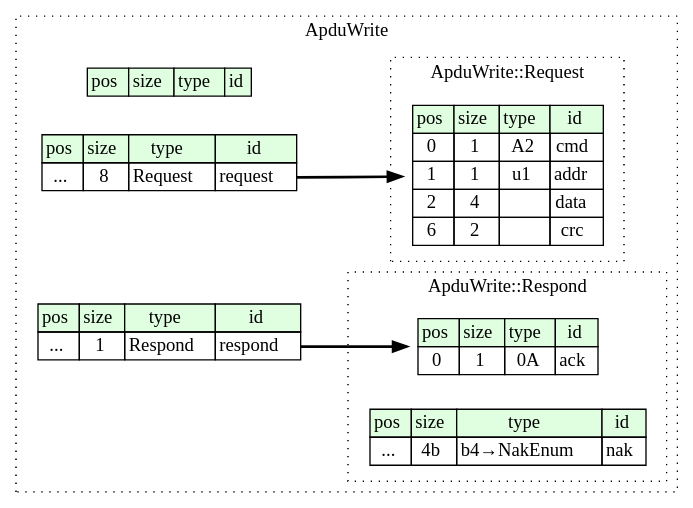

# Цель создания Системы
Позволить клиенту использовать систему Терминал-Считыватель для контроля погрузки с использованием NFC меток

# Возможности
1. Подключение NFC считывателя ACR1281S-C1 к терминалу
2. Сохранение данных погрузки в памяти NFC метки

# Функциональные требования
## Use Cases Diagram

## Use Cases Scenarios
### check Card Number
#### Actors
##### Primary
##### Secondary
- NFC считыватель

#### Description
Система проверяет серийный номер NFC метки на принадлежность к списку доверенных NFC меток

#### Trigger
NFC метка прошла проверку

#### Preconditions
1. NFC считыватель подключен к терминалу
2. NFC метка находится в поле действия считывателя

#### Postconditions
1. NFC метка прошла проверку

#### Normal Flow
2.0 check Card Number
1. Система получает уведомление от считывателя, что карта находится в слоте
2. get Card Number
  - Система отправляет считывателю команду на чтение серийного номера NFC метки
3. Система считывает список доверенных NFC меток из памяти
4. Система проверяет серийный номер метки на принадлежность к списку доверенных номеров

### write Static Data   
#### Actors
##### Primary
##### Secondary
- NFC считыватель

#### Description
Данные, установленные пользователем в скрипте записываются в NFC метку, если она находится в поле действия NFC считывателя

#### Trigger
NFC метка прошла проверку

#### Preconditions
1. NFC считыватель подключен к терминалу
2. NFC метка находится в поле действия считывателя
3. NFC метка прошла проверку

#### Postconditions
1. Статические данные записаны в память NFC метки

#### Normal Flow
3.0 write Static Data
1. write Loader GUID  
  - Система получает GUID погрузчика из памяти
  - Система отправляет считывателю команду на запись GUID погрузчика в поле fieldLoaderGUID1
2. write Coordinates
  - Система отправляет считывателю команду на запись значения широты в поле fieldLocationLatitude
  - Система отправляет считывателю команду на запись значения долготы в поле fieldLocationLongitude
3. write Start Time
  - Система отправляет считывателю команду на запись значения текущего времени в поле startLoadDate
4. write Loader Shares
  - Система отправляет считывателю команду на запись целого числа "1" в поле loaderShares1
5. write State Flags
  - Система отправляет считывателю команду на запись целого числа "1" в поле stateFlags

### write End Time

#### Actors
##### Primary
##### Secondary
- NFC считыватель

#### Description
Значение текущего времени периодически записывается в поле конца погрузки памяти NFC метки, если она находится в области действия NFC считывателя

#### Trigger
В память NFC метки записаны статические данные

#### Preconditions
1. NFC считыватель подключен к терминалу
2. NFC метка находится в поле действия считывателя
3. NFC метка прошла проверку
4. На NFC метку записаны статические данные

#### Postconditions
1. Время конца погрузки записано в память NFC метки
2. NFC метка вышла из области действия NFC считывателя

#### Normal Flow
4.0 write End Time
1. Система получает значение таймаута из памяти
2. По истечении таймаута Система совершает следующие действия
  - Система отправляет считывателю команду на получение статуса NFC метки
  - Система отправляет считывателю команду на запись значения текущего времени в поле stopLoadDate

#### Alternative Flow
Нет

#### Exceptions
4.0.E1 Получен статус отсутствия NFC метки в считывателе
1. Прекратить отправку команды на запись значения текущего времени в поле stopLoadDate

## Диаграммы последовательностей

# Дополнительные функциональные требования
1. Система должна поддерживать подключение считывателя к порту RS-232 при Baudrate 9.6 kbps (default), 19.2 kbps, 38.4 kbps, 57.6 kbps, 115.2 kbps, 230.4 kbps  
2. **TBD** Система должна поддерживать отправку CCID команд считывателю
3. **TBD** Система должна поддерживать прием ответов на CCID команды со стороны считывателя
4. **TBD** Система должна поддерживать отправку APDU с командами FAST_READ, WRITE для PICC типа NTAG216

# Структуры пакетов
## CCID Bulk-OUT command Frame

## Status Frame

## CCID Bulk-IN Frame

## APDU FAST_READ

## APDU WRITE

